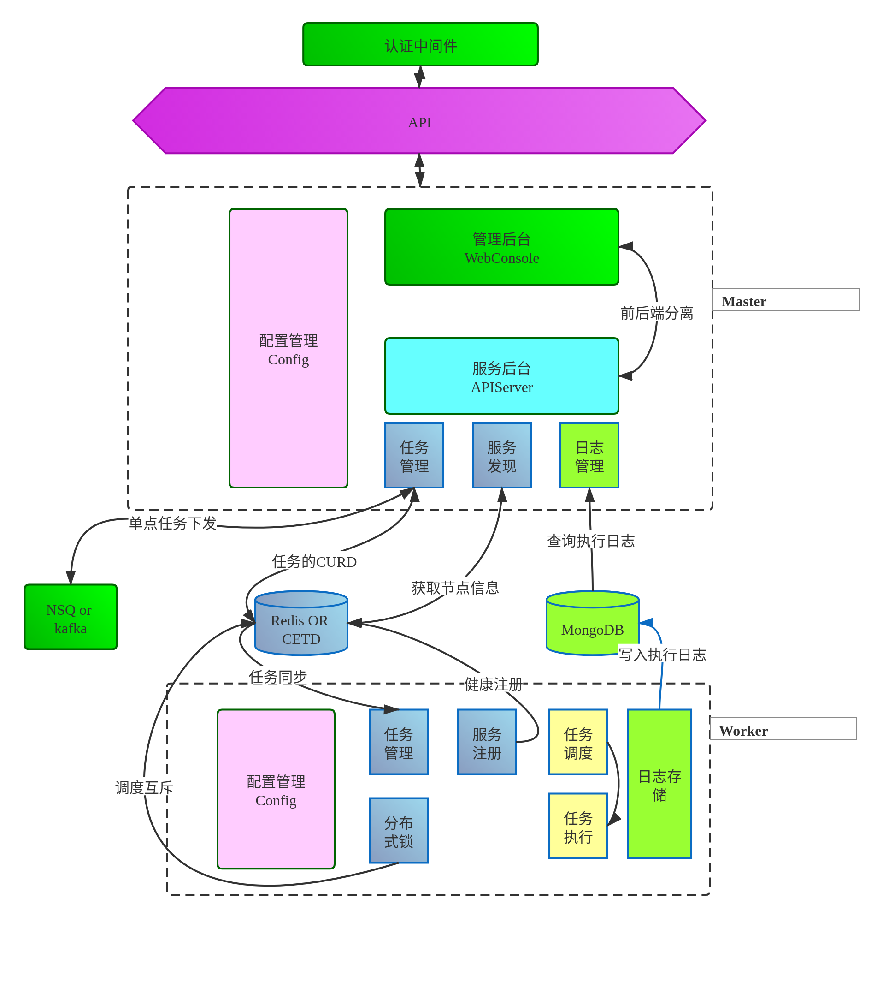

- [API在线文档](#API%E5%9C%A8%E7%BA%BF%E6%96%87%E6%A1%A3)
- [总体架构](#%E6%80%BB%E4%BD%93%E6%9E%B6%E6%9E%84)
- [master服务](#master%E6%9C%8D%E5%8A%A1)
  - [功能](#%E5%8A%9F%E8%83%BD)
  - [完成进度](#%E5%AE%8C%E6%88%90%E8%BF%9B%E5%BA%A6)
- [worker节点](#worker%E8%8A%82%E7%82%B9)
  - [功能](#%E5%8A%9F%E8%83%BD-1)
  - [完成进入](#%E5%AE%8C%E6%88%90%E8%BF%9B%E5%85%A5)
- [使用方法](#%E4%BD%BF%E7%94%A8%E6%96%B9%E6%B3%95)
- [前端部分](#%E5%89%8D%E7%AB%AF%E9%83%A8%E5%88%86)
- [前端架构、登陆注册模块、管理模块、状态管理、性能优化、接口对接](#%E5%89%8D%E7%AB%AF%E6%9E%B6%E6%9E%84%E7%99%BB%E9%99%86%E6%B3%A8%E5%86%8C%E6%A8%A1%E5%9D%97%E7%AE%A1%E7%90%86%E6%A8%A1%E5%9D%97%E7%8A%B6%E6%80%81%E7%AE%A1%E7%90%86%E6%80%A7%E8%83%BD%E4%BC%98%E5%8C%96%E6%8E%A5%E5%8F%A3%E5%AF%B9%E6%8E%A5)
  - [功能](#%E5%8A%9F%E8%83%BD-2)
  - [完成进度](#%E5%AE%8C%E6%88%90%E8%BF%9B%E5%BA%A6-1)
# API在线文档
http://www.l1nkkk.xyz:8888/
# 总体架构

# master服务
## 功能
- 配置信息的读取,配置文件为json文件
- 服务发现，任务管理，日志管理
  - 节点发现：可以通过监听etcd数据库来发现Worker节点
  - 任务管理：实现对任务的下发，删除，杀死，暂停等操作
  - 日志管理：主要是通过对MongoDB数据库的读取获取运行日志。
- 服务后台:向前端和其他应用提供API
- 认证中间件：区分是内部进程调用还是外部用户调用,然后利用中间件在到达API前进行认证
- 日志存储：对API请求进行

## 完成进度
|       功能       | 完成进度 | 预计完成  |                                注                                |
| :--------------: | :------: | :-------: | :--------------------------------------------------------------: |
|    任务的管理    |  已完成  |     *     |                     也就是对etcd数据库的操作                     |
|     获取日志     |  已完成  |     *     |                         对mongodb的读取                          |
|   docker的部署   |   70%    | 2020/3/2  | 未完成Mongodb部署，已完成etcd，Crontab-Masterd的部署和镜像的生成 |
|     节点发现     |  已完成  |     *     |                         对mongodb的读取                          |
|     服务后台     |  已完成  |     *     |                             提供API                              |
| 认证中间2020/3/7 |    0%    | 2020/3/28 |                        防止API的恶意访问                         |
|  传送信息的加密  |    0%    | 2020/3/15 |                          考虑使用https                           |
|     日志存储     |    0%    | 2020/3/7  |        存进一个日志文件，方便后面对其进行审计或者日志分析        |

# worker节点
## 功能
- 配置信息的读取,配置文件为json文件

- 节点注册：往etcd数据库注册节点，让其可悲master发现
- 任务调度：更加不同任务的特性，对任务进行调度。如有点任务的单点指定的，指定某个节点去运行。有点是抢锁方式的。同时支持对任务的强杀。
- 日志管理：对完成后进行日志写入，现阶段是存入mongodbdb数据库
- 安全访问数据库：对连接时做一些认证，如简单秘钥连接
- 数据库集群搭建：对etcd，mongodb的数据库集群搭建
- 搭建一个日志平台ELK+KAFKA(可选，有时间就做)
## 完成进入
|           功能            | 完成进度 | 预计完成  |                              注                              |
| :-----------------------: | :------: | :-------: | :----------------------------------------------------------: |
|         节点注册          |   90%    | 2020/3/7  |                       还需增加一些字段                       |
|         任务调度          |   50%    | 2020/3/15 |         抢锁方式已经完成，现在准备全局模式和单点模式         |
|         日志管理          |  已完成  |     *     |           日志存储的函数已经完成，直接调用就可以了           |
|      安全访问数据库       |    0%    | 2020/4/1  | 现在都是没有认证对一些数据库直接读取，后面设置成需要密码连接 |
|      数据库集群搭建       |    0%    | 2020/4/1  |                   数据库集群化，增加可用性                   |
| 搭建一个日志平台ELK+KAFKA |    0%    |     *     |                             可选                             |

# 使用方法
qqqq

# 前端部分
# 前端架构、登陆注册模块、管理模块、状态管理、性能优化、接口对接
## 功能
- 前端架构：
- 引入react-cli脚手架搭建，代码热刷新功能，一键构建、打包，工程化设计。ant-design UI组件库优化开发。前端整体页面。
- 登陆注册模块
  - 注册模块：nodeJs-express框架结合mongodb数据库存储用户信息，Oauth认证获取qq第三方授权结合Node-mail模块实现邮箱验证，实现注册功能。
  - 登陆模块：通过session-cookie进行登陆认证、前后端鉴权。session存储唯一登陆的用户标识，nodeJs对于session安全加密。
  - 权限管理：通过字段控制用户权限，划分用户为普通用户、管理员身份。
  
- 管理模块：
  - 信息管理：用户信息的编辑、修改；用户密码的修改；nodeJs-multer模块实现用户头像上传修改。
  - 人员管理：对用户按权限查询，划分管理员、普通用户表；并且管理员具备对于普通用户的删除、修改权限等功能。
  - 日程管理：引入ant-design UI组件库，引入日历模块，记录重要事件、按年月日修改以管理日程。

- 状态管理：
  - 使用react Hooks：react Hooks构建小型redux进行状态管理。Hooks简化App.js结构，项目使用结构精简的函数式组件结合Hooks赋予的类组件具备的生命周期、状态管理等功能。以组件为单位引入useContext来全局状态管理。并且结合React.memo嵌套函数组件减少重渲染、减少diff次数以大幅度提升性能。
- 性能优化：
 - 减少首屏加载：使用React.lazy结合suspense挂起异步组件，来减少首屏加载时间。实现路由懒加载。
 - react hooks+函数组件+react.memo浅比较；减少虚拟dom渲染次数。精简项目代码。

- 接口对接
 - 完成任务发布、任务监控等接口的对接和整体项目的页面、路由配置和编写。 

## 完成进度
|      功能      | 完成进度 | 预计完成  |                                 注                                   |
| :------------: | :------: | :-------: | :-----------------------------------------------------------: |
|   前端架构   |  已完成     |     *      |                     react-cli脚手架搭建和配置文件的编写                           |
|   注册模块   |  已完成     |     *      |                         用户数据存入mongodb，nodeJs操作数据                      |
|   登陆模块   |  已完成     |     *      |                     session-cookie登陆认证+前后鉴权、session安全加密、            |
|   管理模块   |  已完成     |     *      |                     用户信息编辑、密码修改、头像上传、人员管理、日程管理              |
|   状态管理   |  已完成     |     *      |                     项目使用reactHooks进行状态管理、函数组件简化项目结构             |
|   性能优化   |  80%    |     2020/3/10      |                   对路由懒加载配置，对组件嵌套Memo减少渲染次数           |
|   接口对接   |  15%    |     2020/3/15      |                   任务发布模块、任务监控模块的接口对接           |
