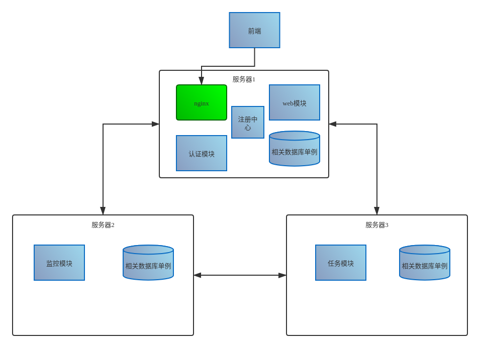

- [总体框架](#%E6%80%BB%E4%BD%93%E6%A1%86%E6%9E%B6)
- [微服务之间的调用](#%E5%BE%AE%E6%9C%8D%E5%8A%A1%E4%B9%8B%E9%97%B4%E7%9A%84%E8%B0%83%E7%94%A8)
  - [向认证模块获取自身会话密钥](#%E5%90%91%E8%AE%A4%E8%AF%81%E6%A8%A1%E5%9D%97%E8%8E%B7%E5%8F%96%E8%87%AA%E8%BA%AB%E4%BC%9A%E8%AF%9D%E5%AF%86%E9%92%A5)
    - [具体实现](#%E5%85%B7%E4%BD%93%E5%AE%9E%E7%8E%B0)
    - [调用API](#%E8%B0%83%E7%94%A8API)
  - [获取调用方的会话密钥](#%E8%8E%B7%E5%8F%96%E8%B0%83%E7%94%A8%E6%96%B9%E7%9A%84%E4%BC%9A%E8%AF%9D%E5%AF%86%E9%92%A5)
  - [调用API的数据格式及如何认证](#%E8%B0%83%E7%94%A8API%E7%9A%84%E6%95%B0%E6%8D%AE%E6%A0%BC%E5%BC%8F%E5%8F%8A%E5%A6%82%E4%BD%95%E8%AE%A4%E8%AF%81)
    - [数据格式](#%E6%95%B0%E6%8D%AE%E6%A0%BC%E5%BC%8F)
    - [如何认证](#%E5%A6%82%E4%BD%95%E8%AE%A4%E8%AF%81)
  - [鉴权](#%E9%89%B4%E6%9D%83)
- [前端用户调用微服务](#%E5%89%8D%E7%AB%AF%E7%94%A8%E6%88%B7%E8%B0%83%E7%94%A8%E5%BE%AE%E6%9C%8D%E5%8A%A1)
  - [web用户注册时为其分配role](#web%E7%94%A8%E6%88%B7%E6%B3%A8%E5%86%8C%E6%97%B6%E4%B8%BA%E5%85%B6%E5%88%86%E9%85%8Drole)
  - [微服务获取web用户权限](#%E5%BE%AE%E6%9C%8D%E5%8A%A1%E8%8E%B7%E5%8F%96web%E7%94%A8%E6%88%B7%E6%9D%83%E9%99%90)
  - [web用户right字段的生成](#web%E7%94%A8%E6%88%B7right%E5%AD%97%E6%AE%B5%E7%9A%84%E7%94%9F%E6%88%90)
- [微服务注册和获取微服务信息](#%E5%BE%AE%E6%9C%8D%E5%8A%A1%E6%B3%A8%E5%86%8C%E5%92%8C%E8%8E%B7%E5%8F%96%E5%BE%AE%E6%9C%8D%E5%8A%A1%E4%BF%A1%E6%81%AF)
- [微服务和ACC之间关于权限的交互](#%E5%BE%AE%E6%9C%8D%E5%8A%A1%E5%92%8CACC%E4%B9%8B%E9%97%B4%E5%85%B3%E4%BA%8E%E6%9D%83%E9%99%90%E7%9A%84%E4%BA%A4%E4%BA%92)
- [ELK日志系统](#ELK%E6%97%A5%E5%BF%97%E7%B3%BB%E7%BB%9F)
  - [日志系统大致架构](#%E6%97%A5%E5%BF%97%E7%B3%BB%E7%BB%9F%E5%A4%A7%E8%87%B4%E6%9E%B6%E6%9E%84)
- [所有功能实现后规划](#%E6%89%80%E6%9C%89%E5%8A%9F%E8%83%BD%E5%AE%9E%E7%8E%B0%E5%90%8E%E8%A7%84%E5%88%92)
- [简介](#%E7%AE%80%E4%BB%8B)
  - [etcd](#etcd)
  - [ELK](#ELK)
- [目标](#%E7%9B%AE%E6%A0%87)
  - [第一阶段(初步预测：now --- 4/1)](#%E7%AC%AC%E4%B8%80%E9%98%B6%E6%AE%B5%E5%88%9D%E6%AD%A5%E9%A2%84%E6%B5%8Bnow-----41)
  - [第二阶段(初步预测：4/1 --- 4/15)](#%E7%AC%AC%E4%BA%8C%E9%98%B6%E6%AE%B5%E5%88%9D%E6%AD%A5%E9%A2%84%E6%B5%8B41-----415)
  - [第三阶段(初步预测:4/15 --- 5/1)](#%E7%AC%AC%E4%B8%89%E9%98%B6%E6%AE%B5%E5%88%9D%E6%AD%A5%E9%A2%84%E6%B5%8B415-----51)
  - [第四阶段(初步预测:5/1 --- 答辩前)](#%E7%AC%AC%E5%9B%9B%E9%98%B6%E6%AE%B5%E5%88%9D%E6%AD%A5%E9%A2%84%E6%B5%8B51-----%E7%AD%94%E8%BE%A9%E5%89%8D)

# 总体框架


<center>

</center>


# 微服务之间的调用
<center>

</center>

- `A-->B(API)`：当微服务A调用服务B的API的时候，先用A的会话密钥SKa对相应敏感信息进行加密。然后发送给服务B
- `认证和获取会话密钥`：B收到API调用后会调用ACC的API对其进行认证以及获取A的会话密钥同时完成了对A的认证。
- `解密`：用A的会话密钥解密被加密部分，进入API处理
- `加密并返回`：用A的会话秘钥SKa对其响应进行的一些部分进行加密，然后返回给微服务A，至此整个调用过程结束。

> 注：

- 这里建议写成三个中间件，分别是认证中间件，鉴权中间件，解密中间件，加密中间件。
web中间件.png
<center>

</center>
## 向认证模块获取自身会话密钥
上面的服务A是如何获得会话密钥的，过程如下。**ACC的ip和port可以通过向etcd查询获得。**

<center>

</center>

- 当每个服务启动的时候，会向注册中心(etcd,一款数据库)中写入自己的注册信息，完成微服务注册。
- 每隔两分钟**业务微服务**会发起挑战应答，其中需要调用`http://127.0.0.1:8080/acc/request_auth`
- 之后**业务微服务**调用`http://127.0.0.1:8080/acc/client_auth`获取自己的会话密钥，用于调用其他服务API

注意细节：
- 密钥会在redis中存放3min，但是每2min就要有一次挑战应答来更新自己的会话密钥，目的是为了`防止出现当C刚刚调用其他微服务的API时，接下来刚好触发了更新会话密钥的情况`
- 所以在保存两个密钥的时候，如果微服务用户调用获取会话密钥的API，会给其返回两个密钥。
<center>

</center>

### 具体实现
客户端C微服务会与认证控制中心S共享一个密钥K，以配置文件的方式初始化到微服务

|           标识            |             表示             |
| :-----------------------: | :--------------------------: |
|             C             |         微服务客户端         |
|             S             |         认证控制中心         |
|             K             |        C与S共享的密钥        |
|           insID           | 在注册发现中心注册的微服务名 |
|            Tc             |            时间戳            |
|            Ts             |            时间戳            |
|             N             |         随机数挑战码         |
| Authenticator<sub>s</sub> |   HMAC<sub>K</sub>(N, Ts)    |
| Authenticator<sub>c</sub> |   HMAC<sub>K</sub>(N, Tc)    |
|             E             |           对称加密           |
|           hash            |             哈希             |
|            SK             |    准备分配给C的会话密钥     |

注：
- HMAC<sub>K</sub>(N, Ts)：表示使用公共密钥K进行HMAC摘要计算
- 会话密钥随着挑战应答，两分钟更换一次
- 如何确保认证中心安全是一个问题


1. C -> S : insID || TC
2. S去同一个注册中心检索该微服务insID，和微服务类class，确定合法后再进行下一步操作。
3. S -> C : Ts || N || Authenticator<sub>s</sub>
4. C收到之后使用挑战码N和Ts进行相同HMAC摘要计算，并与服务器验证信息进行比对，检查计算结果是否一致验证认证控制中心的身份。**至此S的身份认证完成**
5. C -> S : Tc || Authenticator<sub>c</sub>，同4操作，**完成对C的身份认证**
6. S -> C : E<sub>hash(N,K)</sub>(Tc+1, SK)
7. C解密得到密钥，**现在可以使用SK直接和目标微服务发起通信**


### 调用API
微服务A为了获取
1. 挑战请求响应：`http://127.0.0.1:8080/acc/request_auth`
2. 客户端认证与密钥分发：`http://127.0.0.1:8080/acc/client_auth`

详细见api文档

## 获取调用方的会话密钥

- 通过etcd获取ACC的ip和port，之后调用ACC的API`http://127.0.0.1:8080/acc/secrectKey`，请求数据格式说明如下

| key | value如何获得 | 说明 |
| ---  |  --- | --- |
| insIDa | 调用方请求中获取  | 调用方的insID |
| insIDb  |   |  自己的insID |
| timestamp |   | 时间戳 |
| auth  |   HMAC<sub> SK<sub>B</sub></sub>(ID<sub>B</sub>, timestamp)， |  认证信息 |  

> 实例
```json
{
    "ida":"/instance/container/container-1",
    "idb":"/instance/container/container-1",
    "timestamp":"1584340507",
    "auth":"dwfwfsafewefasd1wdw321dfefe"
}

```
- ACC会返回以下信息格式

| key | value | 说明 |
| ---  |  --- | --- |
| errno |   | 错误编号。0表示没有错误 |
| msg  |   |  错误信息 |
| timestamp |   | 时间戳 |
| auth  |   HMAC<sub> SK<sub>B</sub></sub>(ID<sub>B</sub>, timestamp)， |  认证信息 |
| esk | E<sub>SK<sub>B</sub></sub>(SK<sub>A</sub>, timestamp)| 加密过的A的会话密钥SK<sub>A</sub> | 

- 这里有两个是因为密钥过期问题，需要保留前一个的会话密钥，这里作为一种容错措施
```json
{
    "errno":0,
    "msg":"success",
    "auth":
    "data":[
        {
            "esk":"12rffwr3g34tf34w21df3t3g4",
            "expired":"1584340507"
        },
        {
            "esk":"t32e3f34grttg4fewfgrtgsd32",
            "expired":"1584340507"
        }
    ]
}
```


## 调用API的数据格式及如何认证
### 数据格式
<!-- insID ||  || AuthenticatorA || ESKA(M) -->
<!-- - auth : HMAC<sub> SK</sub>(insID, timestamp)  
  - HMAC : SHA1  
- data : -->
A调用B的API的时候需要有以下数据

| key       | value如何获得                                          | 说明                    |
| --------- | ------------------------------------------------------ | ----------------------- |
| insID     | 配置文件中导入，一般放在一全局变量                     | 微服务实例ID            |
| timestamp | 调库获取                                               | 时间戳                  |
| auth      | HMAC<sub> SK<sub>A</sub></sub>(insID, timestamp)，HMAC为sha1       | 用来认证消费者身份      |
| data      | E<sub>SK<sub>A</sub></sub>(M)，M：api文档可知M需要什么，E：初步考虑des | api请求需要的数据的加密 |


> 实例
```json
{
    "insID":"/instance/crontab/crontab-1",
    "timestamp":"1584604278",
    "auth":"122f2fu389tfij2239rjfewoi",
    "data":"rsa9d320rfh923rfjeu2d9je92jrofjewfju329rjfu239rj932jr9fj"
}

```
### 如何认证
微服务B需要对服务A的调用进行认证，这个过程如下
- 首先会调用ACC的API解密后获取A的会话密钥SK<sub>A</sub>
- 便可计算 **HMAC<sub> SK<sub>A</sub></sub>(insID, timestamp)**，之后和`auth`进行匹配

## 鉴权

通过微服务消费者的insID(如/instance/crontab/crontab-1)截取其class，查询其role(角色)。通过role查询其权限
```python
# 伪代码
# 这里只是提供一种方案
需要在运行内存中维护两个map
# 第一个为微服务类型class和role的映射
classToRole = map<string><stringlist>
eg: classToRole["crontab"] = ["role-1","role-2"]

# 第二个为role和权限的映射
roleToAuthority = map<string><string>
eg: classToRole["role-1"] = """{"/crontab/job/save":["POST","GET"],"/crontab/job/list":["GET"]}"""
```

# 前端用户调用微服务
- 前端用户发起https通过nginx转换成http，反向代理到对应微服务中
- 请求头中带有right，其value是一个权限hash值(会过期，避免重放和泄露权限hash带来的危害)
- 微服务对其拿到`right值`，到web权限登记中心redis去查询其right值对应的`roleID(角色ID)列表`，其会返回一个`角色的list`。然后微服务查询本地缓存的role表，得知其是否具有调用该微服务的权限权限。
- 如何识别是从微服务来的调用，还是从前端用户的调用呢：`通过right值区分`

## web用户注册时为其分配role

<center>

</center>

- 在注册前端页面中表单中有role(角色)选项，post后根据这些数据交给ACC写入数据库。
  - 发给ACC的主要数据为(用户名，所选角色)


## 微服务获取web用户权限

<center>

</center>

微服务鉴权的时候通过访问读取redis数据，读取其中的role列表来确定其是否有权限。

## web用户right字段的生成

<center>

</center>

# 微服务注册和获取微服务信息


<center>

</center>

> etcd中的数据实例大致如下

|               key               |      value       |
| :-----------------------------: | :--------------: |
| /instance/Container/Container-1 | 192.168.3.2:8000 |
|       /instance/web/web-1       | 192.168.3.4:3000 |
|       /instance/acc/acc-1       | 192.168.3.3:8080 |

# 微服务和ACC之间关于权限的交互
(注：这一部分放在比较后的时候做)
- 当微服务启动的时候，自动调用ACC相应的API获取权限列表，然后存放到本地内存
- 当权限发生修改的时候，ACC发送一个通知到redis中，然后各个监听的微服务模块收到后，进行权限的修改。


# ELK日志系统

我们在我们代码中，认为有必要的部分进行日志记录，格式为json。比如，当某个API被调用的时候我们可以对其产生日志。


## 日志系统大致架构
<center>

</center>

- 将一些日志数据存放到指定的一个日志文件，如log.json。
- 之后可以通过filebeat监视该文件将其日志进行转发
- filebeat会转发到ELK
- nginx反向代理，让管理员可以访问Kibana


# 所有功能实现后规划
- nginx负载均衡
- 反向shell模块
- net监控数据模块
- 同种微服务部署多个
- 数据库集群部署


# 简介
## etcd
etcd是CoreOS团队于2013年6月发起的开源项目，它的目标是构建一个高可用的分布式键值(key-value)数据库。etcd内部采用raft协议作为一致性算法，etcd基于Go语言实现。

etcd作为服务发现系统，有以下的特点：
- 简单：安装配置简单，而且提供了HTTP API进行交互，使用也很简单
- 安全：支持SSL证书验证
- 快速：根据官方提供的benchmark数据，单实例支持每秒2k+读操作
- 可靠：采用raft算法，实现分布式系统数据的可用性和一致性


## ELK
> 资料：https://www.ibm.com/developerworks/cn/opensource/os-cn-elk-filebeat/index.html


ELK 不是一款软件，而是 Elasticsearch、Logstash 和 Kibana 三种软件产品的首字母缩写。这三者都是开源软件，通常配合使用，而且又先后归于 Elastic.co 公司名下，所以被简称为 ELK Stack。根据 Google Trend 的信息显示，ELK Stack 已经成为目前最流行的集中式日志解决方案。

- Elasticsearch：分布式搜索和分析引擎，具有高可伸缩、高可靠和易管理等特点。基于 Apache Lucene 构建，能对大容量的数据进行接近实时的存储、搜索和分析操作。通常被用作某些应用的基础搜索引擎，使其具有复杂的搜索功能；
- Logstash：数据收集引擎。它支持动态的从各种数据源搜集数据，并对数据进行过滤、分析、丰富、统一格式等操作，然后存储到用户指定的位置；
- Kibana：数据分析和可视化平台。通常与 Elasticsearch 配合使用，对其中数据进行搜索、分析和以统计图表的方式展示；
- Filebeat：ELK 协议栈的新成员，一个轻量级开源日志文件数据搜集器，基于 Logstash-Forwarder 源代码开发，是对它的替代。在需要采集日志数据的 server 上安装 Filebeat，并指定日志目录或日志文件后，Filebeat 就能读取数据，迅速发送到 Logstash 进行解析，亦或直接发送到 Elasticsearch 进行集中式存储和分析。
<!-- 
# 目标
## 第一阶段(初步预测：now --- 4/1)
1. crontab单点任务下发完成，节点注册信息的完善。
2. 毕业论文
3. 监控系统能够在新的节点注册的时候，然后对其主机进行下发任务，开启监控客户端。
4. nginx能够实现反向代理，动静分离，给前端提供https，https转http，跨域。
5. ACC中的认证和加密模块完成。
6. 将加密模块应用到了crontab和监控系统的交互中,如第2点的场景中。
7. 监控模块前后端端口对接

阶段1.png

<center>

</center>

## 第二阶段(初步预测：4/1 --- 4/15)
1. ACC中权限管理完成
2. 毕业论文
3. 各模块API开始尝试添加鉴权中间件
4. web用户权限管理完成
5. ELK开始搭建
6. 同种服务多个部署
7. nginx负载均衡

## 第三阶段(初步预测:4/15 --- 5/1)
1. 各模块开始日志正规化，在必要的地方产生json日志，写入响应文件
2. 毕业论文
3. kibana接上nginx只对管理员用户开放

## 第四阶段(初步预测:5/1 --- 答辩前)
1. 渗透测试
2. 毕业论文
3. 对一些bug进行修改
4. 新功能添加
5. 答辩ppt -->
