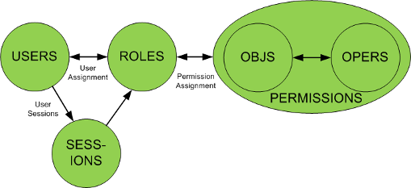
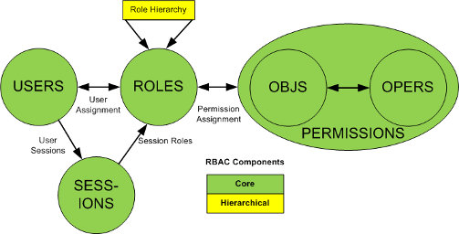
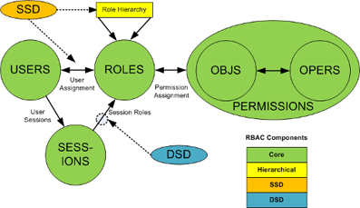
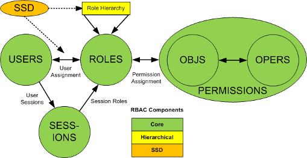
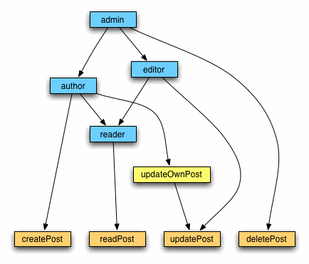
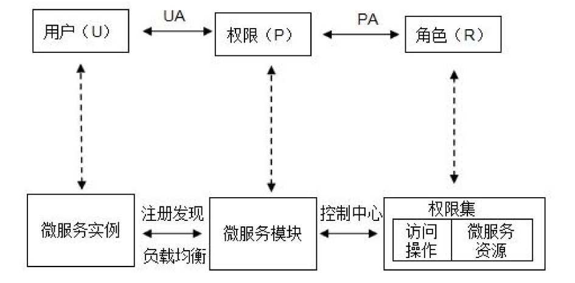
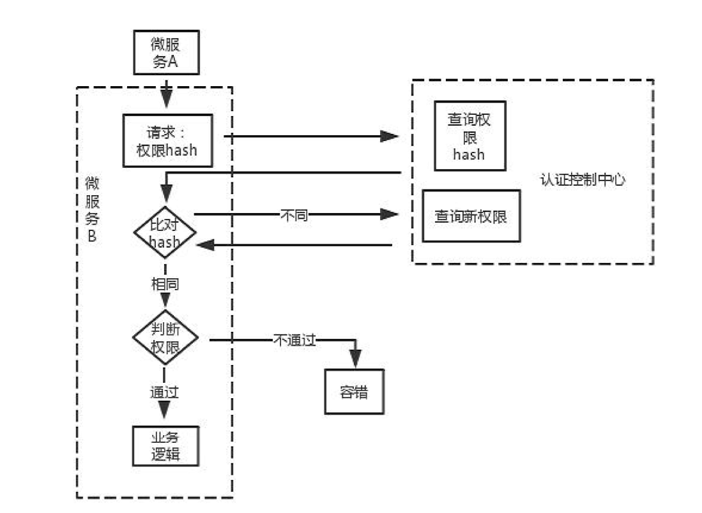

- [意义](#%E6%84%8F%E4%B9%89)
- [功能](#%E5%8A%9F%E8%83%BD)
- [认证与秘钥分发模块的设计](#%E8%AE%A4%E8%AF%81%E4%B8%8E%E7%A7%98%E9%92%A5%E5%88%86%E5%8F%91%E6%A8%A1%E5%9D%97%E7%9A%84%E8%AE%BE%E8%AE%A1)
  - [具体实现](#%E5%85%B7%E4%BD%93%E5%AE%9E%E7%8E%B0)
- [数据安全通信模块设计1](#%E6%95%B0%E6%8D%AE%E5%AE%89%E5%85%A8%E9%80%9A%E4%BF%A1%E6%A8%A1%E5%9D%97%E8%AE%BE%E8%AE%A11)
- [数据安全通信模块设计2](#%E6%95%B0%E6%8D%AE%E5%AE%89%E5%85%A8%E9%80%9A%E4%BF%A1%E6%A8%A1%E5%9D%97%E8%AE%BE%E8%AE%A12)
- [基于角色的权限控制(RBAC)](#%E5%9F%BA%E4%BA%8E%E8%A7%92%E8%89%B2%E7%9A%84%E6%9D%83%E9%99%90%E6%8E%A7%E5%88%B6RBAC)
  - [关于RBAC](#%E5%85%B3%E4%BA%8ERBAC)
    - [用户和权限之间进行设计](#%E7%94%A8%E6%88%B7%E5%92%8C%E6%9D%83%E9%99%90%E4%B9%8B%E9%97%B4%E8%BF%9B%E8%A1%8C%E8%AE%BE%E8%AE%A1)
    - [用户和对象的权限控制](#%E7%94%A8%E6%88%B7%E5%92%8C%E5%AF%B9%E8%B1%A1%E7%9A%84%E6%9D%83%E9%99%90%E6%8E%A7%E5%88%B6)
  - [在微服务中的应用](#%E5%9C%A8%E5%BE%AE%E6%9C%8D%E5%8A%A1%E4%B8%AD%E7%9A%84%E5%BA%94%E7%94%A8)
- [容错处理机制设计](#%E5%AE%B9%E9%94%99%E5%A4%84%E7%90%86%E6%9C%BA%E5%88%B6%E8%AE%BE%E8%AE%A1)
# 意义
- 系统拆分成多个独立模块，扩大了系统的攻击面，容易其中一个服务被当成跳板
- 进程见的通信变为了服务模块间的通信，其通信安全性难以得到保证
- 模块之间每次接收消息都不对消息源进行确认，这种信任关系很容易被利用
- 服务模块结构松散，难以统一管理，出现异常无法及时响应，并且问题定位会花很多时间

# 功能
- 密钥分发方案
- 微服务访问控制机制---限制微服务的访问范围
- 日志监控与分析---微服务的管理监控
- 传输协议定义---完成对传输信息的保密性和完整性的保护工作
# 认证与秘钥分发模块的设计
加密的安全前提：秘钥的安全为前提，安全的秘钥分发做保证

秘钥体系选择：对称加密，因为效率高。

身份认证：周期性地挑战应答来完成客户端微服务的身份认证；也就是说客户端微服务与认证控制中心进行挑战应答，以完成自己身份认证并得到属于自己的会话密钥。存在重放攻击风险

## 具体实现
客户端C微服务会与认证控制中心S共享一个密钥K，以配置文件的方式初始化到微服务

|           标识            |             表示             |
| :-----------------------: | :--------------------------: |
|             C             |         微服务客户端         |
|             S             |         认证控制中心         |
|             K             |        C与S共享的密钥        |
|            IDc            | 在注册发现中心注册的微服务名 |
|            Tc             |            时间戳            |
|            Ts             |            时间戳            |
|             N             |         随机数挑战码         |
| Authenticator<sub>s</sub> |   HMAC<sub>K</sub>(N, Ts)    |
| Authenticator<sub>c</sub> |   HMAC<sub>K</sub>(N, Tc)    |
|             E             |           对称加密           |
|           hash            |             哈希             |
|            SK             |    准备分配给C的会话密钥     |

注：
- HMAC<sub>K</sub>(N, Ts)：表示使用公共密钥K进行HMAC摘要计算
- 会话密钥随着挑战应答，两分钟更换一次
- 如何确保认证中心安全是一个问题


1. C -> S : IDc || TC
2. S去同一个注册中心检索该微服务名IDc，确定合法后再进行下一步操作。
3. S -> C : Ts || N || Authenticator<sub>s</sub>
4. C收到之后使用挑战码N和Ts进行相同HMAC摘要计算，并与服务器验证信息进行比对，检查计算结果是否一致验证认证控制中心的身份。**至此S的身份认证完成**
5. C -> S : Tc || Authenticator<sub>c</sub>，同4操作，**完成对C的身份认证**
6. S -> C : E<sub>hash(N,K)</sub>(Tc+1, SK)
7. C解密得到密钥，**现在可以使用SK直接和目标微服务发起通信**


# 数据安全通信模块设计1
微服务A试图与微服务B进行数据交互时。
|           标识            |                        表示                        |
| :-----------------------: | :------------------------------------------------: |
|            ACC            |                    认证控制中心                    |
|             A             |                      微服务A                       |
|             B             |                      微服务B                       |
|      SK<sub>A</sub>       |                    A的会话密钥                     |
|      SK<sub>B</sub>       |                    B的会话密钥                     |
|            Ta             |                       时间戳                       |
|            Tb             |                       时间戳                       |
|            Ts             |                       时间戳                       |
| Authenticator<sub>A</sub> | HMAC<sub> SK<sub>A</sub></sub>(ID<sub>A</sub>, Ta) |
| Authenticator<sub>B</sub> | HMAC<sub> SK<sub>B</sub></sub>(ID<sub>B</sub>, Tb) |
|             E             |                    对称加密算法                    |


1. A -> B : ID<sub>A</sub> || Ta || Authenticator<sub>A</sub> || E<sub>SK<sub>A</sub></sub>(M)
2. B -> ACC : ID<sub>A</sub> || ID<sub>B</sub> || Tb || Authenticator<sub>B</sub> 
   1. B向ACC确认请求源身份，向ACC请求微服务A的会话密钥SK<sub>A</sub>
   2. 在这一步中要发送Authenticator<sub>B</sub> 表明身份
3. ACC -> B : E<sub>SK<sub>B</sub></sub>(SK<sub>A</sub>, Ts)
4. B使用SK<sub>A</sub>计算参数Authenticator<sub>A</sub>对请求源进行认证。**至此，完成对A的认证**
5. B响应时使用相同的流程实现响应加密

注：
- 这里存在一个问题就是刚好到了失效时间怎么办，需要一定的修改
- 这里面如果调用很平凡，这种持续的加密解密响应是吃不消的
- 
# 数据安全通信模块设计2
- A直接调用B的http接口，信息用自己的会话秘钥加密
- B通过中间件，对A进行认证，鉴权，解密，过程如下
  - 调用ACC的secrectKey接口对其进行认证以及获取会话秘钥(一个或者两个)，如果通过，则下一步
  - 鉴别权限，如果通过，则下一步
  - 使用相同的会话密钥加密返回信息发送给A

# 基于角色的权限控制(RBAC)
> 常见访问控制介绍：https://www.jianshu.com/p/ce0944b4a903

基于角色的权限控制(RBAC)是目前较为常用的访问控制技术，相比自主访问控制(DAC)和强访问控制(MAC)更能满足大部分访问控制需求

## 关于RBAC
因为DAC和MAC的诸多限制，于是诞生了RBAC，并且成为了迄今为止最为普及的权限设计模型。  
RBAC在用户和权限之间引入了“角色（Role）”的概念（暂时忽略Session这个概念）：

<center>

</center>

**每个用户**关联一个或**多个角色**，**每个角色**关联一**个或多个权限**，从而可以实现了非常灵活的权限管理。角色可以根据实际业务需求灵活创建，这样就省去了每新增一个用户就要关联一遍所有权限的麻烦。简单来说RBAC就是：用户关联角色，角色关联权限。另外，RBAC是可以模拟出DAC和MAC的效果的。

数据库软件MongoDB便是采用RBAC模型.
### 用户和权限之间进行设计

- 角色继承(Hierarchical Role)  
    <center>
    
    </center>
    角色继承就是指角色可以继承于其他角色，在拥有其他角色权限的同时，自己还可以关联额外的权限。这种设计可以给角色分组和分层，一定程度简化了权限管理工作。
- 职责分离(Separation of Duty)  
  为了避免用户拥有过多权限而产生利益冲突，例如一个篮球运动员同时拥有裁判的权限（看一眼就给你判犯规狠不狠？），另一种职责分离扩展版的RBAC被提出。
  - 静态职责分离(Static Separation of Duty)：用户无法同时被赋予有冲突的角色。
    <center>
    
    </center>
  - 动态职责分离(Dynamic Separation of Duty)：用户在一次会话（Session）中不能同时激活自身所拥有的、互相有冲突的角色，只能选择其一。
    <center>
    
    </center>

### 用户和对象的权限控制

```php
<?php

$auth=Yii::app()->authManager;
 
$auth->createOperation('createPost','create a post');
$auth->createOperation('readPost','read a post');
$auth->createOperation('updatePost','update a post');
$auth->createOperation('deletePost','delete a post');

// 主要看这里。
// 这里创建了一个名为`updateOwnPost`的权限，并且写了一段代码用来检验用户是否为该帖子的作者
$bizRule='return Yii::app()->user->id==$params["post"]->authID;';
$task=$auth->createTask('updateOwnPost','update a post by author himself',$bizRule);
$task->addChild('updatePost');
 
$role=$auth->createRole('reader');
$role->addChild('readPost');
 
$role=$auth->createRole('author');
$role->addChild('reader');
$role->addChild('createPost');
$role->addChild('updateOwnPost');
 
$role=$auth->createRole('editor');
$role->addChild('reader');
$role->addChild('updatePost');
 
$role=$auth->createRole('admin');
$role->addChild('editor');
$role->addChild('author');
$role->addChild('deletePost');

```
<center>

</center>

在这个Yii的官方例子中，updateOwnPost在判断用户是否具有updatePost权限的基础上更进一步判断了用户是否有权限操作这个特定的对象，并且这个判断逻辑是通过代码设置的，非常灵活。

不过大部分时候我们并不需要这样的灵活程度，会带来额外的开发和维护成本，而另一种基于模式匹配规则的对象权限控制可能更适合。例如判断用户是否对Id为123的文章具有编辑的权限，代码可能是这样的：

```php
<?php

// 假设articleId是动态获取的
$articleId = 123;

if ($user->can("article:edit:{$articleId}")) {
    // ...
}
```

而给用户授权则有多种方式可以选择：

```php
<?php

// 允许用户编辑Id为123的文章
$user->grant('article:edit:123');

// 使用通配符，允许用户编辑所有文章
$user->grant('article:edit:*');

```
虽然不及Yii方案的灵活，但某些场景下这样就够用了。

## 在微服务中的应用
- 角色：把每个微服务模块映射成为RBAC中的角色
- 用户：微服务实例就相应被映射成为RBAC模型中的用户
- 权限：也就是对每个微服务相关资源的访问类型(get put port...)和目标微服务的相关资源(/job/sleep1 ...,可以是某个API或者是某个微服务提供的某个接口)
- 会话：在本方案中不设置。
<center>

</center>

- 资源字段可以描述的是一个微服务，也可以是微服务提供的某个API接口。描述方式为----> “微服务名.资源标识符(或正则)”
- 考虑使用*的正则格式来表达一种资源范围，以代表多个资源目标
- 资源访问权限类型 读权限(readPrivilege)与写权限(writePrivilege)
  - readPrivilege：get
  - writePrivilege：post，delete，put，patch
- 布尔值来表示微服务该操作是否合法
- 资源和目标两个字段来进行数据描述
- 需要对不同级别的资源标识符正则进行不同的设置。比如让用户微服务的所有用户资源对文件微服务不可获取，但是需要让用户微服务中的用户头像信息对文件微服务可获取时，可以设置打范围的否定，小范围的肯定。

- 如果将访问控制都放在了认证中心，这样会很慢，压力也很大。所以需要让微服务定时拉取自己的权限到本地来，进行自我判断，减轻认证中心负担。

<center>

</center>

# 容错处理机制设计
|             情况             |                   处理                   |
| :--------------------------: | :--------------------------------------: |
| 身份认证或者权限检测未通过时 | 响应静态资源来使得整个请求不至于完全失败 |
|  认证出现在会话密钥更换时期  |                重试2-3次                 |
|         无法发放密钥         |              邮件通知管理员              |